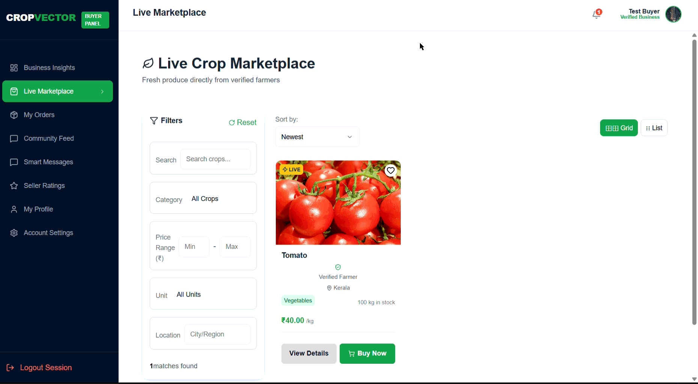
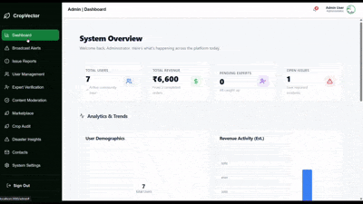
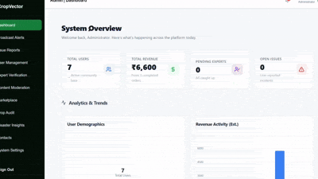

# CropVector UI Preview

A quick visual guide to CropVector, with space for GIFs that show the app flow and main dashboards.

## CropVector landing page

A clean landing experience for the project starts here.

CropVector is a personal agriculture platform for farmers, buyers, experts, community members and admins.
It brings crop planning, marketplace activity, expert guidance, and alerting into one dashboard-driven interface.

### Main value

- Helps farmers make better crop and field decisions.
- Lets buyers discover listings and place orders quickly.
- Lets experts share guidance and manage sessions.
- Keeps admins tracking the full platform.
- Empowers home growers to manage small-scale crops with smart reminders, harvest tracking, and fertilizer recipes.

### Why it exists

CropVector solves the problem of scattered farm tools by centralizing weather, soil, market pricing, and communication in one place.

---

## Farmer Dashboard

A farmer-first control center for fields, crops, and risk alerts.

<table style="border: none; border-collapse: collapse;">
<tr style="border: none;">

<td align="center" style="border: none; padding-right: 25px;">

  

<strong>Field tracking</strong>

</td>

<td align="center" style="border: none; padding-left: 25px;">

  

<strong>Disease & alerts</strong>

</td>

</tr>
</table>

  

  

<strong>Market insights</strong>

Features:
- Crop lifecycle and field tracking
- Disease logging and treatment history
- Soil health insights from Kaegro
- Weather alerts and disaster warnings
- Mandi pricing signals for crop planning

What makes it unique:
- Combines Kaegro soil analysis with OpenMeteo weather alerts and mandi price context.
- Helps farmers decide what to plant, when to harvest, and when to sell.

Tech / APIs:
- Kaegro soil and remote sensing
- OpenMeteo weather
- Mandi pricing service

---

## Buyer / Marketplace Dashboard

An easy marketplace view for buyers to browse listings and manage orders.

  

    
    
<strong>Browse listings</strong>

  

  

    
    
<strong>Order workflow</strong>

  

Features:
- Browse and search crop and machinery listings
- View seller details and product ratings
- Create orders and track shipments
- Read reviews and contact sellers
- Monitor market price trends

What makes it unique:
- Focused on fast procurement and price-aware buying.
- Makes it clear where to buy based on product data and marketplace context.

Tech / APIs:
- Marketplace listing system
- Order and shipment workflow
- Firebase auth for buyer session

---

## Community Dashboard

A central space for community users to discover updates, ask questions, and connect.

  

    
    
<strong>Community feed</strong>

  

  

    
    
<strong>Home Garden</strong>

  

Features:
- Community posts and announcements
- Shared insights from farmers and experts
- Discussion threads and feedback channels
- Access to help, documentation, and project updates
- Quick links to active dashboard sections

What makes it unique:
- Brings the CropVector community together inside the app.
- Supports collaboration and shared problem-solving.

Tech / APIs:
- Community content and messaging
- Firebase auth for user profiles
- Real-time updates via Socket.io

---

## Expert Dashboard

A specialist view for experts to manage consultations, suggestions, and field advice.

  

    
    
<strong>Request queue</strong>

  

  

    
    
<strong>Content Validation workflow</strong>

  

Features:
- Review expert requests and sessions
- Send crop recommendations and treatment advice
- Track suggestion history per farmer
- Access field and disease data
- Communicate through message threads

What makes it unique:
- Built for fast expert response and structured advice.
- Enables experts to respond with data-backed recommendations.

Tech / APIs:
- Expert suggestion engine
- Real-time messaging via Socket.io
- Farmer data integration

---

## Admin Dashboard

A broad admin panel for platform management and oversight.

  

    
    
<strong>User management</strong>

  

  

    
    
<strong>Reports & logs</strong>

  

Features:
- User and role management
- Crop, marketplace, and order oversight
- Reports and system analytics
- Content moderation and alerts
- Platform settings and logs

What makes it unique:
- Provides a single place for platform control and monitoring.
- Keeps CropVector stable and manageable.

Tech / APIs:
- Admin routes and user management
- MongoDB analytics queries
- Backend monitoring and logs

---

## Notes

This file acts as the living visual registry for CropVector's UI. It documents the current state of every dashboard and feature.

Contribution Rule: Whenever you add or modify a feature, you must:

- Record a short screen capture (GIF) demonstrating the flow.
- Place the file in the assets/ folder (matching the naming convention above).
- Update this document with a brief description of the change alongside the new visual asset.

No text-only commits for UI changes—every feature needs a visual proof of concept here. This ensures our documentation stays synchronized with the actual application behavior.

